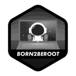

<h3 align="center">👋 Hi there!</h3>
<h3 align="center">I'm Paulo Rafael Ramalho a.k.a. Yaten</h3>

  <a href="https://www.linkedin.com/in/prafaelramalho/">Linkedin</a> •
  <a href="https://discordapp.com/users/184121880695799808">Discord</a> •
  <a href="https://www.instagram.com/xyaten/">Instagram</a>

Passionate self-taught web developer with over ten years of experience, part-time coder, and full-time adventure seeker. I love to explore new technologies and leverage them to solve real-life problems.

---

- 💻 I'm currently working at [Studio XE54](https://xe54.pro/) and studying at [École 42](https://www.42.fr/) - [São Paulo unit](https://www.42sp.org.br/)
- ⚙️ I use daily: `.php`, `.c`, `.js`, `.html`, `.css`, `.psd`
- 🌱 Learning all about `C` and `node.js`
- 📫 Reach me: contact@yaten.dev or [Yaten#0988 at Discord](https://discordapp.com/users/184121880695799808)
- ⚡️ Fun fact: I'm a huge fan of **Serial Experiments Lain** and **Harry Potter**

---

  </a>
   
   
  </a>

---
### 42 Projects

  
  
  
  
  

---

> *No matter where you go, everyone’s connected. – Lain Iwakura*

<!--
**Yaten/Yaten** is a ✨ _special_ ✨ repository because its `README.md` (this file) appears on your GitHub profile.

Here are some ideas to get you started:

- 🔭 I’m currently working on ...
- 🌱 I’m currently learning ...
- 👯 I’m looking to collaborate on ...
- 🤔 I’m looking for help with ...
- 💬 Ask me about ...
- 📫 How to reach me: ...
- 😄 Pronouns: ...
- ⚡ Fun fact: ...
-->
